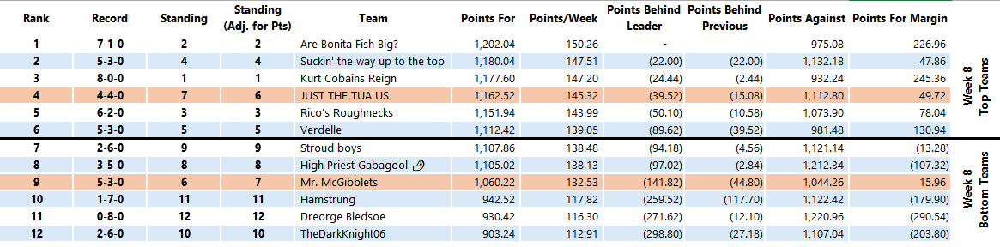
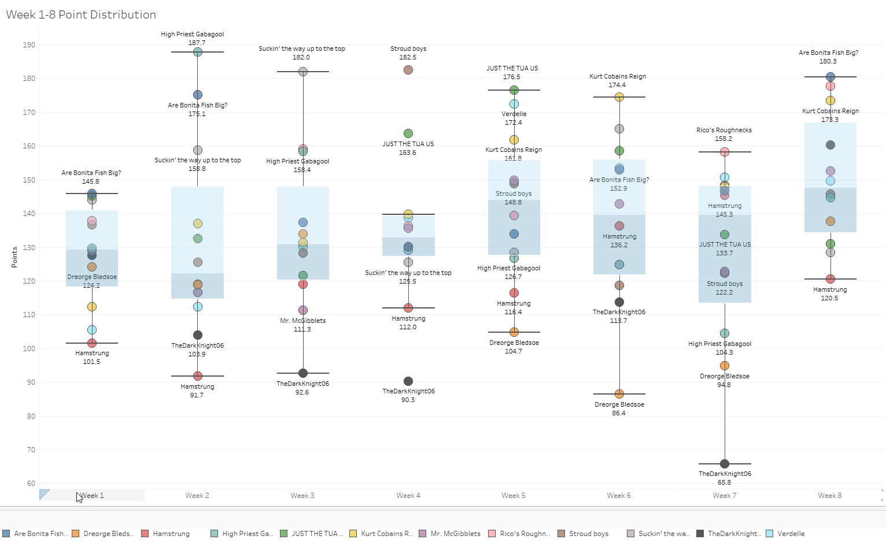

We’re onto Week 9 boys! We’ve got some teams in the hunt for a playoff spot
and others vying for a bye. Let's break it down.

*Top Point Scorers*

Looking at the standings I am assuming that we decided to go with whichever
team, outside of the top 5, that has the most points, gets the 6th seed in
the playoffs. Let me know if I got that wrong.

Regardless, week 8 point totals heading into week 9 are below where we have
Monty cracking into the playoff mix with his current 7th place standing but
4th in points record. This pushes Greg out who has been having a fantastic
run but lacks the points to stay in the top 6 as of today. Aric and
Schlosberg are right on the cusp and need to make up some production to
compete against Paul. Schlosberg is going to need his team to get healthy
so he can start to make-up for the W-L record which is currently not in his
favor at 2-6-0.

For some more fun with the data (although really busy) here is the point
distribution by team through the first 8 weeks. Week 4 was the weirdest
week where we had outlier performances from good and bad teams. Big week
for Schlosberg and Monty and bad week for Dan.

*Match-up Preview for Week 9*

*Dreorge Bledsoe 12th 0-8-0 v High Priest Gabagool 8th 3-5-0*

Aric heard it loud and clear in my first review of our league 2 weeks ago.
He went out and got some players he can start at QB in Gardner Minshew
($27) and Jameis Winston ($33). Incredibly well timed for a solution at QB
appearing to fit his need with Jameis Winston catapulting into the starting
job for the Browns. Jameis Winston is not likely to lead the Browns to an
SB, but as a fantasy producer he has some legit potential as this dude
chucks the ball all game.

The match-up is a close one with George rolling out the Jets defense to the
tune of 19 points and Aric countering with 18.60 points from Davante Adams
and 0.20 from Conklin. Aric underwhelming at TE on Thursday moves this
matchup closer than it was at the start of the week.

I think George’s QB’s in Josh Allen and Sam Darnold easily out match Aric’s
Jameis Winston and Daniel Jones. I think Aric takes the edge and wins this
one with good performances from Jefferson, Connor, Kamara, and Kareem Hunt.

*Favorite: High Priest Gabagool*

*Hamstrung 12th 1-7-0 v Rico’s Roughnecks 3rd 6-2-0*

Brad is heading into the match-up starting Mahomes and Jordan Love at QB
which sounds like an imposing duo until we get down to fantasy reality.
Mahomes has only been able to crack 20 fantasy points twice this year with
a top score of 22. Jordan Love keeps getting hurt. I think Brian’s QB’s
have the upside but I’m still not entirely sure about Drake Maye. Look for
Joe Burrow to have a stellar game and to carry Brian’s QB’s.

Outside of the QB’s Brian is rolling with Gibbs and Jonathan Taylor at RB
and Chase, MHJ, and Christian Watson at WR. I’m sure Brian would love to
have AJ Brown for this match-up to put up more points but, unfortunately
for him, we have rules to follow in this league and his trade is still
pending within the 48 hours.  Brad loses the match-up since he lacks the
firepower to compete against Brian with starts in Amari Cooper, Michael
Pittman, Doubs, Josh Jacobs, and Rachaad White.

*Favorite: Rico’s Roughnecks*

*JUST THE TUA US 6th 4-4-0 v TheDarkKnight06 10th 2-6-0*

Yahoo! Is projecting this matchup to be close this week. Monty 122.28
points and Dan swinging up to 127.11 points after Tank Dell’s massive 126
yards, 6 receptions performance on Thursday. Monty has got Dan beat at QB
with Baker Mayfield and Jayden Daniels looking strong against Kirk Cousins
and Joe Flacco. Cousins and Flacco can put up some serious points but can
be volatile inconsistent plays.

Both teams are starting some shaky rosters this week. For Monty, Calvin
Ridley, Brian Robinson, Nick Chubb all have some question marks around
their expected performance. Further, Gabe Davis is looking like a longshot
to play this week and I don’t think Monty has anyone to plug in at WR with
Stefon Diggs and Mike Evans out this week. Ouch. Dan might actually be able
to capitalize this week dependent on strong performances from Cooper Kupp,
Stevenson, Sam LaPorta ( due to go off on this Lions team), and Jakobi
Meyers appearing to lead in Oakland at WR.

*Favorite: TheDarkKnight06*

*Stroud Boys 9th 2-6-0 v Verdelle 5th 5-3-0*

Stroud Boys really needed their boy Stroud to come up big on Thursday, but
he’s had surprisingly mediocre play all season topping 20 points only 3
times. That’s disappointing because Schlosberg needs this win bad to stay
in the race. Luckily Aaron Rodgers was able to buoy the performance and
make up for what Stroud could not.

Paul has decent starts in Goff and Dak this week but it’s really hard to
tell what those offenses are going to do. I think Goff does ok this week
against a good GB offense and Dak finally starts to put things together
against the Falcons giving Paul the edge at QB.

This is a really close one, but I am going to give Schlosberg the edge at
outside QB positions. Look for Tyreek Hill and Achane (his new flashy toy)
to have solid games this week. I also really like Henry and Aaron Jones to
perform well. Paul’s going to make this competitive with St. Brown, Mooney,
Bijan, and Cade Otton. Will it be enough?

*Favorite: Stroud Boys*

*Mr. McGibblets 7th 5-3-0 v Suckin  the way to the top 4th 5-3-0*

Two 5-3 teams going at it, both needing wins to shape the playoff outlook
in their favor. Greg has been looking really good with Justin Herbert’s QB
play on the upswing and Matt Stafford getting his team back to healthy. Jon
is coming in starting all rookies in Caleb Williams and Bo Nix with Tua on
the bench this week. I like the bold starts but hand the edge to Greg at QB.

This is a battle of the mediocre WR’s this week. Greg with Wandale
Robinson, JSN, and Jeudy against Jon’s Sutton, Legette, and Wicks. Toss up
on who wins here.

RB gets more interesting. Joe Mixon crushed it on Thursday with 16 points
on 106 yards and a TD. I like Chubba Hubbard to compliment him well this
week for Greg. Jon is going to need a superior showing from Saquon Barkley
to keep it competitive especially because I don’t have high hopes in
Javonte Williams going against Baltimore defense.

*Favorite: Mr McGibblets*

*Are Bonita Fish Big? 2nd 7-1-0 v Kurt Cobains Reign 1st 8-0-0 *** Match-up
of the Week****

Battle of the titans in this week’s matchup as I look to stop the 8-win
streak that Tom has been on. It’s going to be tough with another
disappointing performance from Breece Hall while Tom had Garrett Wilson go
nuts with 90 yards on 9 receptions with 2 TD’s to match. Damn.

Lamar Jackson is to Geno Smith as Jalen Hurts is to Kyler Murray. Did I get
the analogy right? Translation, we both have great starts at QB especially
with Jalen Hurts getting back to the type of performance Tom expected and
needs to stay in number one. I think this is going to be a close one and
will come down to Kyler having an ok game against a good defense in Chicago
while Geno Smith performs moderately with his favorable matchup against the
Rams. *Advantage Hodor.*

I dreaded the day that I would have to play Tom with Puka on his roster and
it’s finally arrived. Although Puka is hurt apparently this week I still
think him and London put up big performances against me. Lamb, Olave, and
Flowers are capable of a good performance but not as likely as Tom’s
starters with Olave being the biggest suspect on my roster. I think my WR
week might be dependent on McConkey having a great day, but I’m not
counting on it.* Advantage Tom*.

Before the week started off I would have given myself the advantage at RB,
but Breece Hall underwhelmed and Tom is going in with Kenneth Walker, David
Montgomery, and Swift (flex). Kyren has a chance to put up monster points
and I don’t see why he doesn’t continue his streak of scoring a TD I every
game this season. The question is how many does he get in week 9? *Advantage
Tom.*

This matchup is going to be close and this where I think my trade for
Travis Kelce is going to help me overcome Tom. I think Travis picks things
up for the 2nd half of the season and has a good game today. Ferguson is a
great TE but we all know Cowboys have been suspect at putting their offense
together. *Advantage Hodor.*

With such a close matchup this is the only one where I am going to talk
about defenses. I’m surprised that Tom went with GB this week with Love
being hurt lately and them going against the Lions who might arguably be
the best team in football right now after their 52 point performance last
week. Further the lions have averaged 43 points a week in the past 4 weeks.
Wild. I think the Saints defense going up against Carolina and their
depleted offense with Diontae Johnson shipping off to Baltimore makes this
an easy advantage for me. *Advantage Hodor*.

All in, this is going to be really close with Tom narrowing the projections
b