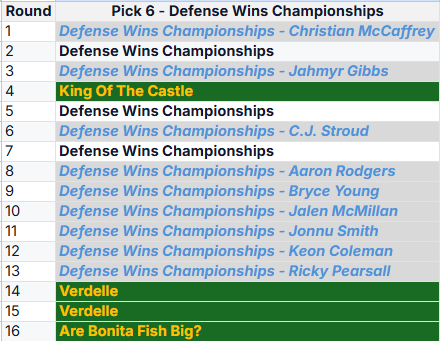
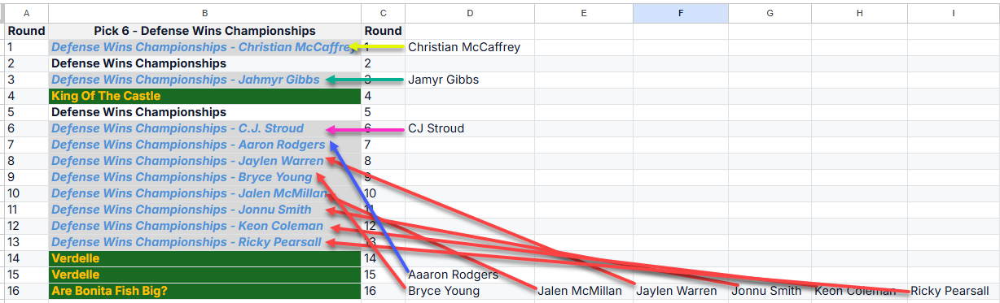

Hello Everyone,

I hope you're all set for our draft happening tonight at 8 PM.

I've received some questions about how the draft will proceed with our
keepers and their "Draft Round Cost" (DRC) slots. To clarify, I've added
two new tabs to our league's transaction tracker file. These should help
you understand how the draft selections will work.

*Keeper Slotting:*

   - Keepers are placed in each manager's "native" draft pick. For example,
   Aric has the 1st pick in all 16 rounds, so his keepers are slotted into the
   first pick of each round he owns.
   - Example: Schlosberg has been quite active in trading picks around and
   as such has given up quite a few of them in exchange for other picks from
   other managers. In this example, I am trying to showcase that his keepers
   have only been slotted into his native picks and that the acquired picks
   are isolated and protected from his keepers:

   1. *Blue - *Indicates a keeper
   2. *Green - *Indicates an acquired draft pick from another manager
   3. *White* - Indicates an open pick available to Schlosberg

I'm not showing it here since I don't have enough space, but Schlosberg has
traded away 4 picks that are being balanced out by picks acquired from the
other managers

   - Pick 4.06 - Acquired by Brian. 3.12 sent back to Schlosberg
   - Pick 14.06 and 15.06 were acquired by Paul. 8.07 and 11.07 were sent
   back to Schlosberg
   - Pick 16.06 acquired by Hodor and 10.10 was sent back

None of these picks that were sent back to Schlosberg were used in
selecting his keepers.

One last way to visually represent this example for where his keepers' DRC
was at and how the affected the slots in his draft.

Here is the link to the google doc. Please look at the last two tabs on the
file for a better understanding of what I am discussing here. Important
concept to understand.

https://docs.g