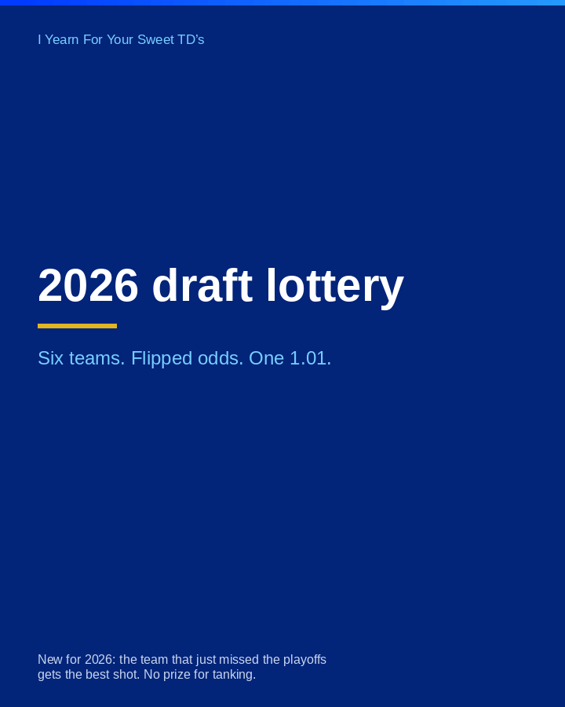

The first draw under the amended weights is done. Six teams, one ball each round, winner removed, same weights renormalized. Watch the reveal:

*Lottery results (picks 1-6):*

- **Pick 1: Dan Vescuso** (Fear the Peel), 50% base odds, finished 7th in 2025
- **Pick 2: Pete Hodor** (Are Bonita Fish Big?), 5% base odds, finished 12th in 2025
- **Pick 3: George Mensing** (Dreorge Bledsoe), 12.5% base odds, finished 9th in 2025
- **Pick 4: Bill Keenan** (The Lady Boys), 15% base odds, finished 8th in 2025
- **Pick 5: Scott Montgomery** (JUST THE TUA US), 10% base odds, finished 10th in 2025
- **Pick 6: Aric Tao** (High Priest Gabagool 🤌🏻), 7.5% base odds, finished 11th in 2025

*Playoff teams (picks 7-12, reverse finish):*

- **Pick 7: Dan MacNulty** (TheDarkKnight06)
- **Pick 8: Alex Schlosberg** (Vesco’s banging bathroom)
- **Pick 9: Tom Watson** (The Prince of Darkness)
- **Pick 10: Greg Pearson** (Mr. McGibblets)
- **Pick 11: Paul Lewis** (Briguy’s Strange Boutte)
- **Pick 12: Brian Malconian** (42°19'50.3'N 71°01'52.0'W)

*How the draw ran:* one pass, 2026-08-15T19:36:11+00:00 UTC, using a cryptographic random source (no seed, no re-rolls). Every round's weights, cutoff bands, and drawn value are in the published draw log, so anyone can re-walk the math. Ask Pete for lottery_draw_log.json if you want to audit it.
